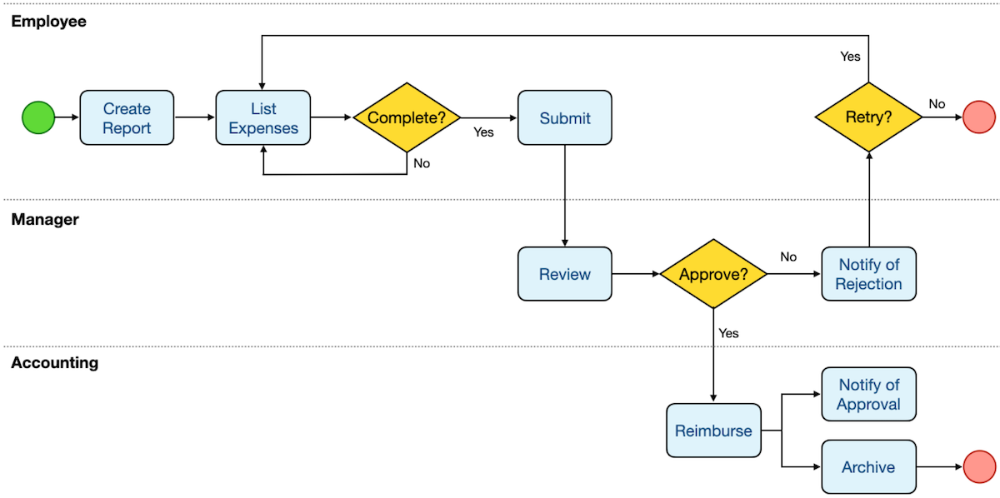
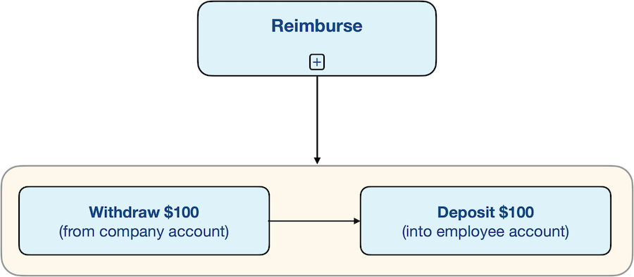
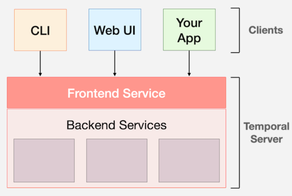
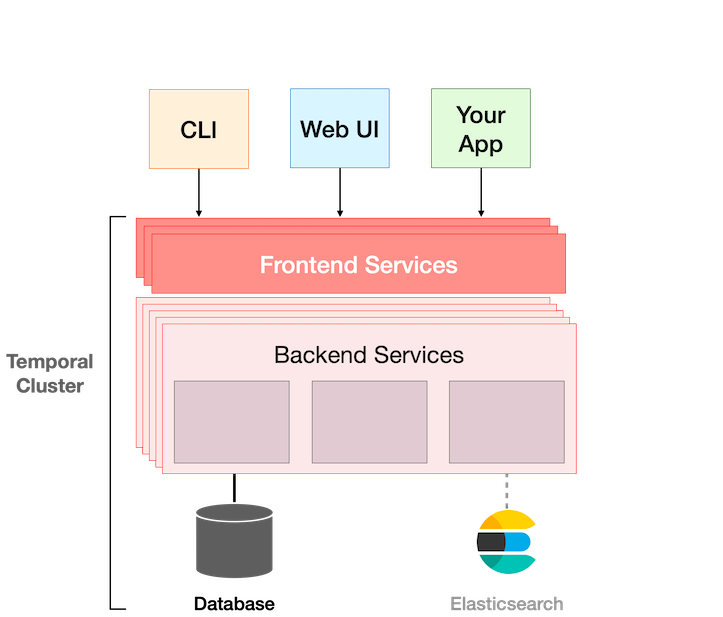
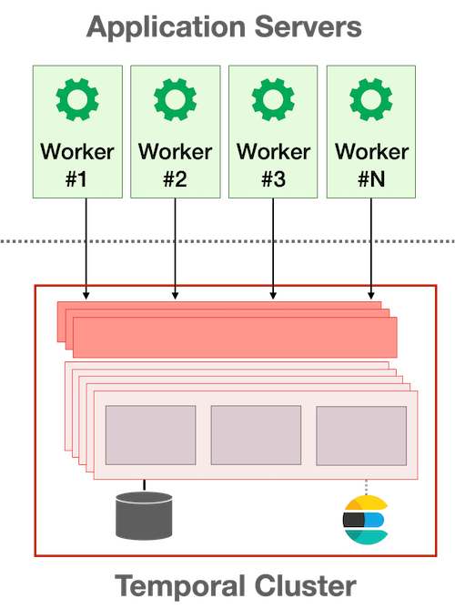

# temporal-learn
Изучаем workflow движок Temporal

Например, если клиент обращается в сервисный центр с претензией относительно качества техники, то требуется произвести следующие работы:

* Зафиксировать входящую заявку.
* Определить, какой тип ремонта требуется.
* Определить сотрудника, который выполнит ремонт.
* Установить лимит времени.
* Назначить лицо, которое проконтролирует качество ремонта.
* Произвести расчёт с клиентом.

Все эти этапы как раз и есть Workflow-процессы для данного отдела компании. Они характеризуются, в первую очередь, тем, что носят во многом рутинный, повторяемый характер.

### Course 101
The Temporal platform handles these types of problems, allowing you to focus on the business logic, instead of writing application code to detect and recover from failures.

Temporal Server не запускает ваш код и даже не имеет доступа к вашему коду. Этим занимаются Worker.

Basic building blocks of Temporal: Workflows and Activities

### Workflow - реализация бизнес-процесса, может работать годами. 
Концептуально это описание последовательности шагов, бизнес-процесс может длиться месяцами, годами.

Имя workflow это его тип. Данные на вход на на выход должны быть сериализуемыми.
Если это чувствительные данные, их можно шифровать. Так же должны быть лимиты на объем этих данных.
Все, что преобразуется в JSON, — это нормально, а такие вещи, как каналы или небезопасные указатели — нет.

Temporal Workflows are resilient. They can run—and keeping running—for years, even if the underlying infrastructure fails. If the application itself crashes, Temporal will automatically recreate its pre-failure state so it can continue right where it left off.

У этого рабочего процесса есть некоторые интересные характеристики:
1) потенциально длительный процесс - от начала до конца может пройти несколько дней, недель или больше.
2) условная логика
3) циклы
4) может включать в себя другие рабочии процессы

Temporal guarantees that there is currently only one execution of a workflow with a given workflow ID in any given namespace.

В одно время выполняется только 1 workflowID

Temporal рекомендует, чтобы ваша Workflow function принимала один входной параметр, структуру, а не несколько входных параметров

Workflow должен быть детерминированным. 
Каждое выполнение Workflow должно возвращать один и тот же результат при одних и тех же входных данных. 
Вы не должны делать такие вещи, как работа со случайными числами в коде workflow. 
Если вам нужно делать такие вещи, как работа со случайными числами, SDK предоставляет безопасные альтернативы. 
Нужно обеспечивать безопасный способ выполнения операций, взаимодействующих с внешним миром(БД, сетевые службы).

Вы можете использовать инструмент Temporal Workflow Check для анализа workflow.

### Workflow - версионирование
вы можете использовать функцию SDK «Versioning», чтобы определить, когда вводятся недетерминированные изменения,
что позволяет более старым исполнениям использовать исходный код, а новым исполнениям — использовать модифицированную версию.

### Архитектура
Temporal не запускает ваш код и даже не имеет доступа к вашему коду.

### Кластер
Temporal Clusters orchestrate code execution

Workers are responsible for actually executing the code

### Workers - код выполняется вне кластера
Worker - сущность, которая отвечает за выполнение кода workflow, поднимается в нескольких инстансах
Для связи с кластером используется GRPC. Workers опрашивают(long polling) Task Queue в поисках работы для выполнения.

Activity и Workflow должны быть зарегистрированы с помощью функций: RegisterWorkflow, RegisterActivity

Workflow может работать годами, в то время как сервер, на котором работает Worker, может быть перезагружен через несколько месяцев администратором, выполняющим техническое обслуживание.
Если Workflow был зарегистрирован с другими Worker's, один или несколько из них автоматически продолжат работу с того места, на котором остановился исходный Worker.

Что бы Worker взяли новую версию кода их нужно перезапустить

### Activity - инкапсуляция бизнес-логики, которая склонна к сбоям.
В отличие от определения Workflow, не требуется, чтобы определение действия было детерминированным.
Любая операция, которая может привести к сбою, должна выполняться как часть действия, а не как часть Workflow напрямую.
Хотя Activity выполняются как часть Workflow, у них есть важная характеристика: в случае сбоя они повторяются.

Workflow не вызывает Activity. 
Вместо этого он делает запрос к Temporal Cluster, прося его запланировать выполнение Activity.

Как и в случае с выполнением Workflow, вызов ExecuteActivity возвращает Future, поскольку результат, возвращаемый Activity, не будет доступен до тех пор, пока Activity не завершится.

**Start-to-Close** - время после которого считаем, что на воркере был сбой, после этого Task пересоздастся и его подберет другой Worker

**RetryPolicy**
* InitialInterval - через какое время после первоначального сбоя произойдет первая повторная попытка
* BackoffCoefficient - множитель для расчета задержки между каждой последующей попыткой
* MaximumInterval - ограничение по времени для задержки
* MaximumAttempts - максимальное количество разрешенных повторных попыток, прежде чем действие будет помечено как неудавшееся

Event History - восстановление текущего состояния в случае сбоя

###Материалы
#### Saga
https://temporal.io/blog/saga-pattern-made-easy

#### Cluster
https://github.com/temporalio/helm-charts

#### Self-hosted
https://github.com/temporalio/docker-compose

####Как масштабировать?
horizontally scalable and a production environment will typically run multiple instances of each

https://temporal.io/blog/scaling-temporal-the-basics